# 🤖 UMS ChatBot

[](https://opensource.org/licenses/MIT)
[](https://reactjs.org/)
[](https://nodejs.org/)
[](https://python.org/)
[](https://openai.com/)

> **UMS ChatBot** is an AI-powered university assistant that answers student queries about courses, registration, results, and other academic details. It leverages a modern full-stack architecture with a React frontend, Node.js + Express backend, and a Python RAG (Retrieval-Augmented Generation) pipeline powered by LangChain, FAISS, and OpenAI Embeddings.

---

## 🚀 Highlights

- **🔍 Retrieval-Augmented Generation (RAG) Pipeline**  
  Custom JSON knowledge base with fast semantic search and answer generation using LangChain, FAISS, and OpenAI Embeddings.

- **💬 Interactive Chatbot UI**  
  Built with React and Tailwind CSS for a modern, responsive experience.

- **🔗 Seamless Integration**  
  Node.js backend connects the React frontend to the Python RAG logic.

---

## 🛠 Tech Stack

| Layer      | Technologies                         |
| ---------- | ------------------------------------ |
| Frontend   | React, Tailwind CSS                  |
| Backend    | Node.js, Express                     |
| RAG Engine | Python, LangChain, FAISS, OpenAI API |
| Other      | dotenv                               |

---

## 📁 Folder Structure

```
UMS-Chatbot/
├── 📁 client/              # React frontend
│   ├── 📁 public/
│   ├── 📁 src/
│   │   ├── 📄 App.js
│   │   ├── 📄 index.js
│   │   └── 📁 styles/
│   └── 📄 package.json
├── 📁 server/              # Node.js backend
│   ├── 📄 index.js
│   └── 📄 package.json
├── 📁 rag/                 # Python RAG pipeline
│   ├── 📄 main.py
│   ├── 📄 ums_paths.json
│   └── 📄 .env
└── 📄 README.md
```

---

## ⚡️ Quick Setup

1. **Clone the Repo**

   ```bash
   git clone https://github.com/Shaktiprasadram22/Ums_chatbot_01.git
   cd Ums_chatbot_01
   ```

2. **Install Backend Dependencies**

   ```bash
   cd server
   npm install
   ```

3. **Install Frontend Dependencies**

   ```bash
   cd ../client
   npm install
   ```

4. **Install Python Dependencies**

   ```bash
   cd ../rag
   pip install openai langchain faiss-cpu python-dotenv
   ```

5. **Add OpenAI API Key**
   - Create a `.env` file in `rag/` with:
     ```env
     OPENAI_API_KEY=YOUR_OPENAI_API_KEY
     ```

---

## ▶️ How to Run

1. **Start Python RAG Pipeline**

   ```bash
   cd rag
   python main.py
   ```

2. **Start Node.js Backend**

   ```bash
   cd server
   node index.js
   ```

3. **Start React Frontend**

   ```bash
   cd client
   npm start
   ```

4. **Access the App**  
   Open [http://localhost:3000](http://localhost:3000) in your browser.

---

## 🔄 Workflow

1. **React** sends user query to **Express server**.
2. **Express** calls **Python RAG pipeline**.
3. **Python** searches vector DB and returns answer.
4. **Express** responds to **React**.
5. **Chatbot** displays the reply.

---

## 🏗️ System Design

```mermaid
graph TD
    A[👤 User] --> B[⚛️ React Frontend]
    B --> C[🔗 Express Backend]
    C --> D[🐍 Python RAG Pipeline]
    D --> E[📚 LangChain Processing]
    E --> F[🧠 OpenAI Embeddings]
    F --> G[🔍 FAISS Vector Search]
    G --> H[📊 JSON Knowledge Base]
    H --> I[💡 Generated Answer]
    I --> D
    D --> C
    C --> B
    B --> A

    style A fill:#e1f5fe
    style B fill:#f3e5f5
    style C fill:#e8f5e8
    style D fill:#fff3e0
    style E fill:#fce4ec
    style F fill:#f1f8e9
    style G fill:#e3f2fd
    style H fill:#fff8e1
    style I fill:#f9fbe7
```



### Architecture Components:

- **⚛️ React Frontend**

  - Interactive chat interface
  - Sends user questions to Express API
  - Displays answers dynamically

- **🔗 Node.js + Express Backend**

  - Receives HTTP POST requests from React
  - Spawns Python process with question
  - Gets RAG pipeline result
  - Sends response back to React

- **🐍 Python RAG Pipeline**

  - Loads knowledge base JSON
  - Splits and embeds text with LangChain + OpenAI
  - Uses FAISS vector store for fast semantic search
  - Returns best answer for user query

- **🔒 .env Security**
  - OpenAI API key is secured in `.env` and loaded at runtime

---

## 🧑‍💻 Key Skills

- React
- Node.js
- Express.js
- Python
- LangChain
- FAISS
- OpenAI Embeddings
- REST API
- dotenv
- CORS
- JSON knowledge base

---

## 🎨 Personal Interests

- 📸 Photography
- 💻 Web Development

---

## 🤝 Contributing

Contributions are welcome! Here's how you can help:

1. **Fork** the repository
2. **Create** a feature branch (`git checkout -b feature/amazing-feature`)
3. **Commit** your changes (`git commit -m 'Add some amazing feature'`)
4. **Push** to the branch (`git push origin feature/amazing-feature`)
5. **Open** a Pull Request

---

## 📄 License

This project is licensed under the [MIT License](LICENSE).

---

## 👤 Author

**Built by [Shakti Prasad Ram](https://github.com/Shaktiprasadram22/)**

---

## 🔗 GitHub Repository

[https://github.com/Shaktiprasadram22/Ums_chatbot_01/](https://github.com/Shaktiprasadram22/Ums_chatbot_01/)

---

<div align="center">
  <p>⭐ Star this repo if you found it helpful!</p>
  <p>Made with ❤️ for the educational community</p>
</div>
